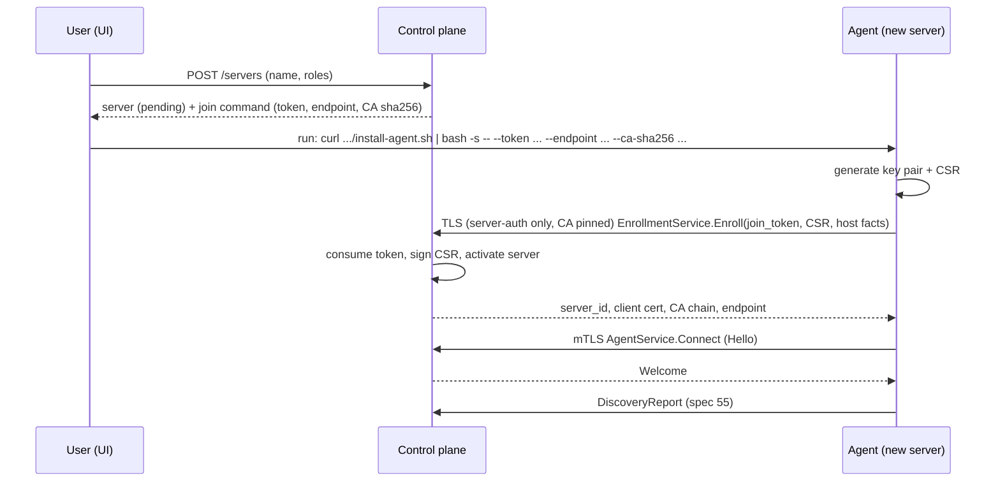
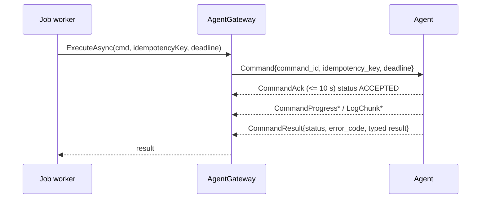

# ADR 0002: Agent communication

- Status: accepted
- Date: 2026-10-03
- Scope: control plane (.NET) <-> server agent (Go), `IServerTransport`, security model
- Contract: [`proto/aethera/agent/v1/`](../../proto/aethera/agent/v1/) (frozen at the end of Phase 0; only the orchestrator changes it)
- Spec: sections 13, 31, 42-44, 55 of `docs/idea/01_AppIdea.md`

## Context

Aethera manages Docker hosts that sit behind NAT, home routers and provider firewalls. The control plane must run builds, deployments and maintenance on them, stream logs and metrics back in real time, and keep working through flaky networks. Spec section 31 forbids exposing an unrestricted shell to the internet, and section 44 requires the platform to tell apart "control plane / server / agent / Docker / application unavailable".

The locked decision (plan) is: the agent **dials out** to the control plane over gRPC with mTLS (primary), and an SSH transport exists for bootstrap/install and as a fallback.

## Decision summary

1. The agent opens **one long-lived bidirectional gRPC stream** (`AgentService.Connect`) over TLS 1.3 with **mutual authentication**. The control plane never connects to the agent; servers need **no inbound ports** for Aethera.
2. Identity is an **X.509 client certificate** issued by an **internal CA** in the control plane. Agents obtain it by **enrolling** with a **one-time join token** (`EnrollmentService.Enroll`, the only RPC callable without a client cert).
3. The control plane can only ask the agent to run a **typed allowlist of commands** (`Command.request` oneof). There is no exec/shell command.
4. Reliability comes from: exponential backoff with jitter, application heartbeats, idempotency keys with a result cache on the agent, absolute command deadlines, and an explicit cancel message.
5. Log streaming is multiplexed on the same stream with **per-stream credit-based flow control** and a priority send queue so logs can never starve heartbeats or results.
6. The control plane talks to servers through **`IServerTransport`**: `AgentTransport` (primary) and `SshTransport` (bootstrap + degraded fallback).
7. Server health is modelled as **separate status axes** matching spec section 44, never a single "online" flag.

## Topology

```
                         outbound only (agent dials)
  +------------------+   gRPC / HTTP2 / mTLS (TLS 1.3)    +--------------------------+
  |  Go agent        | ---------------------------------> |  Aethera control plane   |
  |  (per server)    |  Connect: AgentMessage <-> Control |  Kestrel gRPC listener   |
  |  Docker socket   | <--------------------------------- |  AgentGateway            |
  +------------------+                                    |  Internal CA, join tokens|
          ^                                               +--------------------------+
          | local only                                                 |
     docker.sock                                      SshTransport (bootstrap/fallback)
```

### Listener and TLS

- The control plane exposes a **dedicated gRPC listener** (default `:9443`, configurable) separate from the HTTP UI/API listener. It must be reachable by agents; if the API sits behind a reverse proxy (Traefik), the gRPC port is published directly or via TLS **passthrough** (SNI TCP router). Terminating TLS at a proxy would break client-certificate authentication, so this is documented as unsupported.
- Kestrel is configured with `ClientCertificateMode.AllowCertificate`; a custom `ClientCertificateValidation` callback validates the chain **against the Aethera CA only** (not the OS trust store), checks `ExtendedKeyUsage = clientAuth`, validity dates, and that the serial is not revoked. A gRPC interceptor then requires an authenticated identity for every method except `EnrollmentService/Enroll`.
- The control plane's server certificate is issued by the same internal CA by default (SAN = configured public hostname/IP). The agent trusts **only** the CA bundle it received at install/enroll time (`--ca-sha256` pin on first contact), so a public CA compromise or DNS hijack cannot impersonate the control plane. Operators may instead supply a publicly trusted server certificate; the agent then additionally trusts system roots (`trust_system_roots: true`) but still presents its client cert.
- TLS 1.3 only; HTTP/2 keepalive (below); max gRPC message size 8 MiB (log chunks are far smaller, see below).

## Identity and enrollment

### Internal CA

- ECDSA P-256 root, 10-year validity, generated on first start of the control plane. The private key is stored in Postgres **encrypted with the master key** (`AETHERA_MASTER_KEY`, AES-256-GCM envelope, same mechanism as secrets). An optional intermediate/offline-root layout is future work.
- Agent leaf certificates: **30-day** validity, `CN = <server_id>`, SAN URI `spiffe://aethera/server/<server_id>`, `ExtendedKeyUsage = clientAuth`. The identity used for authorization is **only** the SAN URI; any `server_id` claimed in message bodies (Hello) must equal it or the stream is closed with `PROTOCOL_VIOLATION`.
- The control plane's own server certificate: 90 days, auto-renewed in place (Kestrel reloads the cert without restart).
- **Revocation**: the control plane is the only verifier, so it keeps a table of `(serial, server_id, revoked_at)` and rejects revoked serials in the validation callback; deleting a server or "reset agent" revokes its certs and closes the live stream with `Disconnect(REVOKED)`. No CRL/OCSP distribution is needed.
- **Renewal**: the agent calls `AgentService.RenewCertificate` (authenticated by its still-valid cert) when `renew_before` (default 10 days) before expiry is reached, or immediately on `CertRotationHint`. A new key pair is generated each time; the agent reconnects with the new cert. An agent whose cert fully expired must re-enroll with a fresh join token.

### Join tokens

- Generated by the control plane when the user clicks "Add server": 256 random bits, base64url, prefix `aeth_join_`. Only the **SHA-256 hash** is stored (`join_tokens`: `id`, `token_hash`, `server_id`, `expires_at`, `used_at`, `created_by`).
- **One-time**: consumed with a single atomic statement (`UPDATE ... SET used_at = now() WHERE token_hash = @h AND used_at IS NULL AND expires_at > now() RETURNING server_id`). A replay, expired, or unknown token returns `PERMISSION_DENIED` with an identical message for all three (no oracle).
- Default TTL **1 hour**, maximum 24 hours. Bound to a pre-created `Server` record (state `pending`), so the token decides which server the cert belongs to; the agent cannot choose its identity.
- `Enroll` is rate-limited per source IP (e.g. 10 attempts / minute) and audit-logged (success and failure, never the token).
- CSR handling: the control plane verifies the CSR signature, key type (EC P-256/P-384 or RSA >= 3072), and **ignores the CSR's subject and SANs**, substituting its own. The private key is generated on the host and never transmitted.

### Enrollment flow



The `--ca-sha256` value in the install command is the pin used to authenticate the control plane during the very first (unauthenticated-client) call. If the user runs the install script over SSH from the UI (`SshTransport` bootstrap), the control plane injects the same values itself.

## The `Connect` stream

### Session lifecycle

1. Agent dials, completes mTLS, sends **`Hello`** (server_id, agent version, protocol version, capabilities, boot/process ids, still-running command ids, active log stream ids, reconnect attempt).
2. Control plane validates identity, **supersedes any older stream** for the same server (older one receives `Disconnect(SUPERSEDED)`), registers the session, and answers **`Welcome`** (heartbeat/metrics/discovery intervals, concurrency and log limits, server time, min agent version). Version too old: `Disconnect(UPGRADE_REQUIRED)`.
3. Agent sends a `DiscoveryReport`, then steady state: `Heartbeat`, `MetricsReport`, `EventNotice`, `LogChunk`, `Command*` messages one way; `Command`, `CancelCommand`, `Ping`, `LogFlowControl`, `CertRotationHint` the other.
4. The control plane reconciles in-flight work against `Hello.running_command_ids` (see "Command idempotency") and re-requests any log streams it still wants.
5. Orderly shutdown: either side finishes with `Disconnect`/stream completion. The agent never exits because the stream dropped: containers it manages keep running independently of the control plane.

### Message ordering and size

- gRPC guarantees in-order delivery within the stream. Messages are small by design; the largest are `DiscoveryReport` and `ContainerInfo.inspect_json` (bounded, env values stripped) and `ComposeProject` file contents.
- `LogChunk.data` is capped by `Welcome.log_chunk_max_bytes` (default 32 KiB).

### Reconnect and backoff

Agent side, implemented in the Go transport package:

| Parameter | Value |
|---|---|
| Initial delay | 1 s |
| Multiplier | 2 |
| Maximum delay | 60 s (after 10 consecutive failures: 5 min) |
| Jitter | **full jitter**: sleep = `random(0, min(cap, base * 2^n))` |
| Reset | only after a connection stayed `Welcome`d and healthy for **>= 60 s** (prevents a flapping control plane from resetting backoff each connect) |
| Server hint | `Disconnect.reconnect_after` overrides the next delay |
| Fatal | `Disconnect(REVOKED)`: stop retrying, log loudly, wait for re-enrollment. `UPGRADE_REQUIRED`: attempt self-update path, then retry |
| TLS/cert errors | retry every 5 min with a clear log line (`certificate expired - re-enroll`), no hot loop |

Full jitter prevents a thundering herd when the control plane restarts with hundreds of agents.

While disconnected the agent:
- keeps containers and any in-progress commands running (commands continue until completion or their deadline),
- keeps a bounded ring buffer of `EventNotice`s (1000 events / 15 min) and flushes it after `Hello`,
- does **not** buffer metrics (gaps are acceptable; the UI shows "no data" rather than interpolating),
- keeps command results in its result cache (see below),
- spools build/deploy log chunks to disk (bounded, 64 MiB per stream) and resumes from the control plane's acknowledged sequence.

### Heartbeat, keepalive and liveness

Two layers, because TCP/HTTP2 liveness and application liveness fail differently.

| Layer | Mechanism | Defaults |
|---|---|---|
| Transport | HTTP/2 keepalive PING (both directions) | every 20 s idle, 10 s ack timeout; on failure the stream is torn down and the agent reconnects |
| Application | `Heartbeat` message from the agent | every **15 s** (`Welcome.heartbeat_interval`), carries `seq`, `sent_at`, `docker_status`, `running_commands` |
| RTT / probing | `Ping` / `Pong` from the control plane | on demand and every 60 s when otherwise idle |
| Metrics | `MetricsReport` | every **10 s** (`Welcome.metrics_interval`) |

- The control plane marks the agent **unavailable** after **3 missed heartbeats (45 s)** *or* immediately when the stream closes unexpectedly, and closes the stream with `Disconnect(HEARTBEAT_TIMEOUT)` in the first case. Any inbound message counts as proof of life, so a busy log stream cannot cause false timeouts.
- Heartbeats and acks/results travel through a **priority queue** in the agent's sender (control messages before log data), so a flood of logs cannot delay them.
- Clock skew: `Heartbeat.sent_at` and `Welcome.server_time` let both sides compute offset. Deadlines are absolute timestamps but the agent converts them to a local monotonic timeout using the skew measured at `Welcome`, so a wrong host clock does not make commands expire instantly or never.

## Command allowlist

`Command.request` is the complete list of what the control plane can make an agent do. The set maps onto the roadmap: container ops, image ops, volume ops, network ops, Compose ops, builds (+ repository build detection), log streaming, health probes, proxy ensure, discovery refresh, `docker system prune` with explicit flags, agent self-update. Anything else (arbitrary exec, file read/write, shell) is **not representable** in the protocol. Adding a command type is a protocol change that needs an ADR amendment.

Design notes:

- **Fixed argv, never shell strings.** The agent uses the Docker SDK where possible, and for `docker compose` / `git` / `nixpacks` / BuildKit invokes binaries with a fixed argv assembled from validated fields (`exec.Command`, no `sh -c`). Compose file *contents* are data written to the agent-owned project directory.
- **Agent-side policy** (`/etc/aethera/agent.yaml`, root-owned, not remotely changeable): allowed bind-mount host prefixes (default: only `/var/lib/aethera/**`; extendable by the admin), always-denied sources (`/var/run/docker.sock`, `/etc`, `/root`, agent state dir), forbidden container options (privileged, host namespaces, devices, `cap_add`), allowed probe targets, allowed log drivers, max concurrent commands. Violations are rejected with `ACK_STATUS_REJECTED_POLICY` / `ERROR_CODE_POLICY_VIOLATION`.
- **Self-update** (`AgentSelfUpdate`): HTTPS URL only; the agent verifies the SHA-256, and a detached Ed25519 signature when a release key is configured; swaps the binary atomically and exits for the service manager (systemd) to restart it, keeping the previous binary for automatic rollback if the new one fails to reach `Welcome` within 2 minutes.
- **Capabilities** (`Hello.capabilities`, e.g. `build.dockerfile`, `build.nixpacks`, `compose.v2`, `proxy.traefik`, `logs.follow`, `selfupdate`) gate dispatch; an unsupported command is never sent, and one that arrives anyway is acked `REJECTED_UNSUPPORTED`.

## Command idempotency, timeouts, cancellation

### Dispatch protocol



- **Ack timeout**: no `CommandAck` within 10 s => the gateway treats the dispatch as failed (stream is probably dead) and the job retries on the next session. A rejected ack fails fast with the reason.
- `CommandResult` is terminal and sent exactly once per accepted command per delivery; `replayed = true` marks a cached answer.

### Idempotency

- `Command.command_id` is unique per *delivery*. `Command.idempotency_key` is stable for one *logical operation* and is derived by the job engine as `"<job_id>:<step>:<retry_no>"`. `retry_no` increases only when the previous attempt **reported a failure** and the job engine deliberately retries (a new key, so it truly re-executes). A **redelivery after an unknown outcome** (stream dropped, control plane crashed, worker lease lost) reuses the same key.
- The agent keeps an **idempotency table** `key -> {state: running | done, result, finished_at}`; entries live 24 h (and at least the longest deadline), capped at 5000, persisted to `/var/lib/aethera/state/` so an agent restart doesn't forget them. Behaviour on arrival of a key it knows:
  - `running`: ack `DUPLICATE_RUNNING`; the new `command_id` is bound to the running execution and receives its result.
  - `done`: ack `DUPLICATE_COMPLETED`, then immediately send the cached result with `replayed = true`. **Failed results are cached too**; the retry-number in the key is what permits genuine re-execution.
- **Reconnect reconciliation.** After `Hello`, for every command the control plane believed in flight on that server: if its id is in `running_command_ids`, keep waiting; otherwise re-dispatch it with the same idempotency key. The agent either replays the cached result (it finished while disconnected) or, if it never saw it, executes it. This removes the need for an explicit result-ack protocol.
- Operations are also made naturally idempotent: removing something that does not exist succeeds, `NetworkCreate.if_not_exists`, `ContainerCreate.replace_existing`, volume/network creates with the same spec return the existing object.

### Timeouts

- Every command has an **absolute `deadline`** set by the job engine from per-type defaults: list/inspect 30 s, start/stop 30 s + `timeout`, image pull 10 min, build 30 min (configurable per app), compose up 10 min, health probe `start_period + retries * (timeout + interval)`, prune 10 min.
- The agent wraps execution in a context with the deadline; at expiry it aborts the work (build SIGINT then kill, pull cancel) and reports `TIMED_OUT`. A command arriving past its deadline is acked `REJECTED_EXPIRED`.
- The gateway has its own watchdog: if no result arrives by `deadline + 30 s` (agent hung/disconnected) it fails the wait with `agent_unavailable`; the command is *not* assumed to have failed on the host, which is why reconciliation on reconnect matters.

### Cancellation

- Cancelling a job sends `CancelCommand{command_id, reason, grace}` for each in-flight command of that job (default grace 15 s). The agent cancels the execution context: builds get SIGINT then SIGKILL after `grace`, pulls and compose invocations are context-cancelled, log streams are closed. It replies with `CommandResult` status `CANCELLED`.
- If the stream is down, cancellation is recorded and delivered after reconnect (the control plane sends `CancelCommand` for any `running_command_ids` whose job is cancelled); if the agent is gone for good the command dies at its deadline. The job is marked `Cancelled` locally after `grace + 10 s` regardless, flagged `orphanedCommands` for reconciliation.
- Disconnects do **not** cancel commands on the agent. A build that is half-done keeps going; its logs spool to disk; the result is recovered via idempotent re-dispatch.

## Log streaming and flow control

All log traffic shares the single stream with everything else. HTTP/2 flow control is per-stream (here: per *call*), so one noisy container would otherwise delay heartbeats and results. Therefore:

1. **Chunking.** The agent line-buffers output and emits `LogChunk`s of up to `log_chunk_max_bytes` (32 KiB) or 250 ms, whichever comes first. `sequence` is strictly increasing per `stream_id` from 1.
2. **Credit-based flow control per `stream_id`.** The agent may have at most `window_bytes` un-acked bytes in flight per stream (initial `Welcome.log_initial_window_bytes`, default 256 KiB). The control plane sends `LogFlowControl{stream_id, acked_sequence, window_bytes}` once it has durably handled chunks: for build/deploy logs after the batch is written to Postgres, for live container logs after fan-out. It sends an ack roughly every half window. `window_bytes = 0` pauses a stream (used when a log stream's subscribers vanish).
3. **When credit runs out:**
   - `BUILD` / `DEPLOY` logs are **lossless**: the agent stops reading the child process pipe (natural back-pressure; a build slows rather than loses output) and spools to a disk file when its in-memory buffer fills (64 MiB cap, then a truncation marker line).
   - `CONTAINER` follow streams are **lossy-with-marker**: the agent drops the oldest buffered data and reports `dropped_bytes` on the next chunk; the UI shows `-- N KiB skipped --`.
   - `AGENT` logs: only WARN+ are forwarded, same lossy policy.
4. **Priority.** The sender keeps two queues: *control* (heartbeat, acks, progress, results, events, pongs) and *data* (log chunks, metrics). Control is always drained first; a message in flight is at most 32 KiB, so worst-case head-of-line delay for a heartbeat is a single chunk.
5. **Reconnect resume.** `Hello.active_log_stream_ids` lists streams the agent still serves/spools. For each, the control plane replies with a `LogFlowControl` carrying its last durably stored `acked_sequence`; the agent re-sends everything after it. `INSERT ... ON CONFLICT DO NOTHING` on `(stream_id, sequence)` makes replay safe. Container follow streams do not resume: the control plane re-issues `LogStreamStart{since = last timestamp}`.
6. **Secret masking.** The agent knows the secret values of the command it is executing (secret `EnvVar`s, `BuildSecret`s, registry and git credentials) and replaces them with `***` in log lines **before** sending, including across chunk boundaries (masking works on the line buffer). The control plane masks again on ingest as defense in depth (spec section 9, 31).
7. **Fan-out** to browsers is handled after ingest, see [ADR 0004](./0004-jobs-and-deployments.md).

## `IServerTransport`

The control plane's deployment engine never talks gRPC or SSH directly. It uses an abstraction in `Aethera.Domain`:

```csharp
public interface IServerTransport
{
    TransportKind Kind { get; }                       // Agent | Ssh
    TransportCapabilities Capabilities { get; }       // flags, see below

    ValueTask<TransportStatus> GetStatusAsync(ServerId server, CancellationToken ct);

    // Typed command in, typed result out. TCommand is the domain mirror of the proto allowlist.
    Task<CommandOutcome<TResult>> ExecuteAsync<TCommand, TResult>(
        ServerId server, TCommand command, CommandOptions options, CancellationToken ct)
        where TCommand : IServerCommand<TResult>;

    IAsyncEnumerable<LogEntry> StreamLogsAsync(ServerId server, LogStreamRequest request, CancellationToken ct);
    IAsyncEnumerable<ServerEvent> SubscribeEventsAsync(ServerId server, CancellationToken ct);
}

[Flags] public enum TransportCapabilities
{
    None = 0, ContainerOps = 1, ImageOps = 2, VolumeNetworkOps = 4, Compose = 8, Builds = 16,
    LogFollow = 32, PushEvents = 64, PushMetrics = 128, HealthProbe = 256, SelfUpdate = 512
}
```

`CommandOptions` carries `IdempotencyKey`, `Deadline`, `JobId`, a progress sink and a log sink. `ServerCommand` types mirror the proto messages one to one (they are the *domain* types; a mapper converts to/from `Aethera.Agent.V1`), so the engine and its tests never depend on generated code or on a particular transport. A `FakeServerTransport` implements the interface for unit tests (no Docker daemon needed in CI, per the plan).

A `ServerTransportResolver` picks the transport per call: **AgentTransport if the agent session is connected**, otherwise **SshTransport if the server has SSH credentials and `allowSshFallback` is true**, otherwise it fails with `server.agent_unavailable` (or `server.unreachable`). The chosen transport and capability gaps are recorded on the job ("ran over SSH fallback"); a command whose capability the transport lacks fails fast with `transport.unsupported` instead of half-working.

### AgentTransport (primary)

Implemented by `AgentGateway` (Grpc.AspNetCore service) plus a **session registry** (`server_id -> session`, in memory; the API runs as one instance in the MVP; a Redis-backed registry is the path to multiple instances). It maps `ExecuteAsync` to `Command`/`CommandResult`, enforces ack timeouts and watchdogs, performs reconnect reconciliation, ingests metrics and logs, and raises `ServerEvent`s. All capabilities.

### SshTransport (bootstrap + fallback)

Built on SSH.NET (WP2.3). Two roles:

1. **Bootstrap.** "Add server by SSH" stores the key/password as an encrypted secret, runs the install over SSH (download or SFTP-upload the agent binary, verify SHA-256, write the systemd unit and `agent.yaml`, run `enroll` with a fresh join token, start the service) and waits for the agent to appear in the session registry. From then on the resolver prefers `AgentTransport`.
2. **Fallback / degraded mode.** If the agent is down (or never installed, by choice), the transport executes an **allowlisted Docker CLI** over SSH:
   - Each typed command maps to a fixed `docker ...` argv template. Variable parts must pass strict validators (container/network/volume names `^[a-zA-Z0-9][a-zA-Z0-9_.-]{0,127}$`, image references against the OCI grammar, ports as integers) and are POSIX single-quote escaped because SSH `exec` takes one string. No caller-supplied string is ever interpreted as a command.
   - **Secrets never appear in argv** (visible in `ps`): they go over stdin (`docker login --password-stdin`) or a `0600` temp env-file that is deleted afterwards.
   - Compose: files are uploaded over SFTP to `/var/lib/aethera/projects/<name>/`, then `docker compose -p <name> -f ... up -d`.
   - Logs: `docker logs --since ... --tail ... [-f]` over an exec channel, mapped to `LogEntry`.
   - Health probes run through an SSH **direct-tcpip** forward, so loopback targets on the server resolve from the server's perspective.
   - Metrics: **polled** every 30 s with read-only commands (`cat /proc/stat`, `/proc/meminfo`, `/proc/loadavg`, `df -P`, `docker stats --no-stream --format ...`, `docker ps --format ...`), parsed into the same `MetricsReport` shape. No push events: `PushEvents`/`PushMetrics` are absent from its capabilities and the UI marks the server "degraded: polling over SSH".
   - Builds are **not** supported in the general case (no Nixpacks/BuildKit orchestration); only `IMAGE` pulls and `docker build` of a public git URL are allowed. Anything else returns `transport.unsupported` with the hint "enable the agent on this server or use a build server".
   - Host keys are pinned on first connect (TOFU) with a stored fingerprint; a change blocks the connection until the user confirms.
   - Connection pool: one multiplexed SSH connection per server with keepalive; commands run on separate channels with a per-server concurrency limit.

## Failure model (spec section 44)

Status is **five independent signals**, shown separately in the UI and API (`ServerStatus` and `ApplicationStatus` expose them as distinct fields; there is no combined "online").

| Axis | Meaning | How it is determined | Shown where |
|---|---|---|---|
| **Control plane unavailable** | The user's browser/CLI cannot reach the Aethera API (or the agent cannot reach the control plane) | Browser: failed `/ready` fetch / SignalR disconnect (status bar goes red). Agent: its own log and, when it returns, `Hello.reconnect_attempt`. The control plane cannot observe its own absence, so this axis is only client-side | status bar, login banner |
| **Server unavailable** | The machine itself does not answer | Agent session down **and** a control-plane *reachability probe* of the server's address fails (TCP connect to the SSH port, or a configured port, every 30 s while the agent is down; ICMP is not required). With no probe target configured the state is `unknown`, not `unavailable` | server list/detail |
| **Agent unavailable** | Host answers, but no agent session | Agent session down (stream closed, or > 45 s without a heartbeat) while the reachability probe succeeds | server list/detail |
| **Docker unavailable** | Agent is connected but the Docker daemon is not usable | `Heartbeat.docker_status != RUNNING` (stopped, unreachable, permission denied, not installed) and `EVENT_TYPE_DOCKER_DAEMON_DOWN` | server detail, affected apps |
| **Application unavailable** | Server, agent and Docker are fine, the workload is not | Container exited/OOM/restarting, container health `UNHEALTHY`, Aethera `HealthProbe` failing, no running container for a deployed app | application/service pages |

Derivation rules: evaluate in the order Server, Agent, Docker, Application and attribute the problem to the **first failing layer**; the layers below it are shown as `unknown (blocked by <layer>)` rather than falsely "down". Example: when the agent is unavailable, application status says "unknown: agent unavailable", not "stopped". Last-known data is kept with a "stale since" timestamp. Transitions are debounced (e.g. 2 consecutive failed reachability probes) and written to an event table that feeds the alerts system later (spec section 20).

With only `SshTransport`, "agent" is `not installed` (a fourth value next to connected/unavailable) and Docker state comes from polling.

## Security model

### Assets and trust boundaries

| Asset | Where it lives | Protection |
|---|---|---|
| CA private key | control plane DB | AES-256-GCM envelope with `AETHERA_MASTER_KEY`; never leaves the control plane |
| Agent private key | agent host `/var/lib/aethera/agent.key` (`0600`, owner `aethera-agent`) | generated locally, never transmitted; renewed on rotation |
| Join tokens | hash only in DB; plaintext shown once | 256-bit, single use, 1 h TTL, bound to a server record |
| Secrets (env, registry, git creds) | encrypted at rest in the control plane; in `SecretValue` on the wire | TLS 1.3 mTLS; injected only into the command that needs them; held in agent memory only; masked in logs; never persisted to agent disk (Compose gets them via process environment, not a file) |
| Docker socket on the host | root-equivalent | only the agent process can reach it; the agent only executes allowlisted, policy-checked commands |

### Threats and mitigations

| Threat | Mitigation |
|---|---|
| Network attacker / MITM | TLS 1.3; agent pins the Aethera CA; control plane accepts only certs from its CA |
| Rogue agent / stolen join token | One-time, short-lived token bound to a pre-registered server; rate limiting; audit entry; token useless after use |
| Stolen agent certificate | Identity is per-server; revoke serial in DB (immediate effect at next handshake; live stream closed); 30-day lifetime limits the window; key is `0600` on the host. A compromised agent can only affect *its own* server |
| Compromised control plane | Inherent: it holds all secrets and can command every agent. Mitigations are hardening the control plane itself (spec section 31: least privilege, audit log, encrypted secrets), and the typed allowlist limiting what a *bug or injection* in the control plane can do to a host |
| Command injection through fields | No shell anywhere in the agent path: fixed argv, SDK calls, validators for names/refs; SSH transport quotes and validates every interpolated token |
| Dangerous container options (privileged, host mount of `/`, docker.sock) | Not representable in `ContainerSpec` (privileged, namespaces, devices, cap_add absent); bind mounts checked against agent-local policy that the control plane cannot override |
| SSRF through health probes | Probe targets limited to loopback, Docker networks and an admin allowlist in `agent.yaml` |
| Malicious self-update | HTTPS only, SHA-256 mandatory, optional Ed25519 signature with a release key baked into the agent, atomic swap with auto-rollback |
| Replay of commands | Transport is TLS (no replay); `deadline` bounds validity; idempotency keys make duplicates harmless |
| Log leakage of secrets | `SecretValue` type redaction (generic, by descriptor), agent-side masking of known secret values, ingest-side masking, `// SECRET: never log` convention enforced by a unit test that walks the descriptor and fails if a `string`/`bytes` field named like a secret (`password`, `token`, `key`, `secret`) is not a `SecretValue` |
| DoS by a client | Max message size, per-session command and log credit limits, `Enroll` rate limit, one stream per server |
| Agent over-privilege | Runs as dedicated user `aethera-agent` in the `docker` group (note: that is root-equivalent on the host; rootless Docker is supported and recommended where possible), systemd hardening (`NoNewPrivileges`, `ProtectSystem=strict`, `ReadWritePaths=/var/lib/aethera`, `PrivateTmp`), no listening sockets |
| Repudiation | Every dispatched command writes an audit event (actor, server, command type, resource, outcome) **without payloads** |

### Secret-handling rules for code

1. A field carrying secret material is a `SecretValue` (or an `EnvVar` using its `secret` arm / `RegistryAuth` / `GitCredentials`). Plain `string` fields never hold secrets.
2. Log, audit and error code must pass protobuf messages through the shared redactor (replace every `SecretValue`, drop `Command.compose_file`/`override_file` bodies to length+hash).
3. Error messages returned in `CommandResult.error_message` are produced from sanitized text only.

## Protocol evolution

- Package `aethera.agent.v1` evolves **additively**: new fields and new oneof arms only; never reuse or renumber a field. `buf breaking` (rule set `FILE`) runs in CI against `master`.
- `Hello.protocol_version` / `Welcome.min_agent_version` negotiate compatibility; the control plane supports N-1. Unknown oneof arms are ignored by the receiver (and for `Command`, acked `REJECTED_UNSUPPORTED`).
- A breaking change means a new package `aethera.agent.v2` served side by side on the same listener.
- Generated code (Go + C#) is committed; the generation script verifies there is no drift in CI.

## Alternatives considered

| Option | Why not |
|---|---|
| Control plane connects **in** to an agent API (HTTP/gRPC) | Needs inbound ports and public reachability on every server, NAT/firewall friction; bigger attack surface (spec section 31 explicitly warns against exposing the agent) |
| SSH-only, no agent (Coolify's model) | No push metrics/events/log flow control, expensive per-command sessions, hard to make builds and long streams robust, weaker identity model. Kept as the fallback instead |
| HTTP long-polling / WebSocket JSON | Works, but loses typed contracts, bidi streaming semantics and the .NET/Go gRPC tooling; we would re-invent framing and codegen |
| Message broker (NATS/MQTT) between control plane and agents | Extra component to install and secure for a self-hosted product; mTLS identity and per-server authorization are simpler on gRPC |
| WireGuard/Tailscale mesh as *the* transport | Valuable (Phase 7) but needs kernel/VPN setup on every host; it is complementary: the gRPC link can ride over it later |
| Shared-secret/bearer-token agent auth | Weaker than mTLS (secret replay, no per-agent revocation without a lookup on every message, no channel binding) |

## Consequences

- (+) Servers behind NAT work with zero inbound configuration; the same code path works for the local agent on the control plane's own host.
- (+) Strong, revocable per-server identity; a typed, auditable command surface; low latency push of metrics and events.
- (+) Robust against flaky networks through idempotent redelivery and spooling.
- (-) The control plane must expose a gRPC port with mutual TLS (cannot sit behind a TLS-terminating proxy); documented in the install guide.
- (-) We operate a small PKI (CA, renewal, revocation). Mitigated by keeping it internal, simple (single CA, DB-backed revocation) and fully automatic.
- (-) Two transports to maintain; the SSH fallback is deliberately limited and capability-flagged so it cannot silently diverge.
- (-) Single active API instance in the MVP (in-memory session registry); horizontal scale-out needs a shared registry, tracked as future work.

## Appendix: control-plane implementation (WP2.2)

This appendix records how the gateway implements the decisions above, where it chose, and what it added. Code: `Aethera.Domain/Transport` (abstractions and typed commands), `Aethera.Infrastructure/Agents` (CA, enrollment, sessions, ingestion, dispatch, status, retention), `Aethera.Api/Features/Agents` (gRPC services, Kestrel setup, REST endpoints).

### Layout and seams

- **Domain mirror.** `IServerTransport`, the 35 command records (one per `Command.request` arm), their results and the discovery types live in `Aethera.Domain.Transport`; the engine depends on nothing else. `CommandMapper` (Infrastructure) is the only place that converts to and from `Aethera.Agent.V1`; a test pins that every command is mapped, every protocol arm is covered and the numeric enum values stay equal by name.
- **Sessions.** `AgentSessionRegistry` (server id to state, in memory) holds the live `AgentSession`, the commands still awaiting an answer (they belong to the server, not to a stream), stream aliases and subscribers. One API instance in the MVP, as designed; the registry class is the seam for a Redis-backed one.
- **Transport resolution.** `ServerTransportResolver` orders the registered `IServerTransport`s by `TransportKind` (agent first), skips unavailable ones, lets the SSH transport stand in only when `ISshFallbackPolicy` allows, and fails with `transport.unsupported` on a capability gap. **WP2.3 adds `SshTransport` by registering another `IServerTransport` (Kind = Ssh) and, optionally, replacing `ISshFallbackPolicy`; nothing in the resolver changes.**
- **Testing.** `FakeServerTransport` (in `Aethera.Testing`) scripts results per command type for engine tests; `FakeAgent` in `Aethera.Api.Tests` plays the agent side of the stream.

### Listener

- `Aethera:Agents:GrpcPort` (default 9443) is a second Kestrel endpoint: HTTP/2, **TLS 1.3 only**, `ClientCertificateMode.AllowCertificate`, validation callback = the Aethera CA only (chain, `clientAuth`, validity, SAN identity, in-memory revoked serials). An invalid certificate fails the handshake; a missing one is allowed and decided by the interceptor.
- Because Kestrel ignores `ASPNETCORE_URLS` once an endpoint is configured in code, the setup re-binds the API's own addresses (`urls`, else `HTTP_PORTS`/`HTTPS_PORTS`, else `http://localhost:5000`).
- A path-based middleware keeps the listeners apart: `/aethera.agent.v1.*` is served only on the gateway port, and nothing else is served there. A join token therefore cannot be sent to the plain-HTTP API listener (the request is a 404).
- The listener's own certificate (EKU serverAuth, SAN = host of `PublicEndpoint` plus loopback) is issued by the CA on the first handshake and replaced after two thirds of its life (60 of 90 days) without a restart. It is not persisted: a restart issues a new one, which agents accept because they pin the CA, not the leaf.
- `AgentAuthInterceptor` is the authoritative check: the certificate serial must exist in `agent_certificates`, not be revoked, be inside its validity and belong to the server named in the SAN, and the server must exist. Revocation therefore takes effect for every new call at once, on every instance; the in-memory list (refreshed every 30 s) only makes the handshake fail early.

### Enrollment

- The CSR is validated **before** the join token is consumed (signature = proof of possession, EC P-256/P-384 or RSA >= 3072, <= 8 KiB); its validity says nothing about the token, so this is no oracle, and a malformed CSR does not burn a token.
- Token consumption and certificate issuance share one transaction. Unknown, expired, revoked, used and malformed tokens return the same `PERMISSION_DENIED` message. `Enroll` is limited to 10 attempts per minute per source IP, counting every attempt.
- Renewal keeps the old certificate valid until the agent reconnects with the new one; the session handler then revokes every certificate of that server issued before it (`superseded by renewal`).
- `POST /servers` still returns only the server; the install command comes from `POST /servers/{id}/join-tokens` (the UI calls both). The command is `curl -fsSL <script> | sudo bash -s -- --token ... --endpoint ... --ca-sha256 ...`; the script URL is `Aethera:Agents:InstallScriptUrl`, else `<API origin>/install-agent.sh`.

### Stream handling

- The reader acknowledges and routes; an ordered worker does the database work, so a slow insert never delays an ack, and a `CommandResult` is processed after the log chunks that precede it.
- Heartbeat watchdog: no message for `HeartbeatMissLimit x HeartbeatSeconds` (3 x 15 s = 45 s) closes the stream with `HEARTBEAT_TIMEOUT`; an idle stream is pinged after `PingSeconds`. Only the **current** session may mark the agent unavailable, so a superseded stream ending does not flap the status.
- Reconciliation after `Hello`: pending commands the agent lists as running keep being awaited; the others are re-sent with the same idempotency key under a new `command_id` (log sequence numbers of such a fresh execution are offset past what is already stored). Commands already sent on the new session are skipped, which closes the race between a `Hello` and a command dispatched right after `Welcome`.
- Log ingest: build/deploy/agent chunks go to `log_chunks` with `ON CONFLICT DO NOTHING` and are acknowledged (`LogFlowControl`) only afterwards, about every half window and at end of stream. A chunk whose stream the control plane did not register (command id, build id, `LogStreamId`) is dropped and never acknowledged; agent logs are stored as `agent:<serverId>:<processId>` (sequences restart with the process). Container follow chunks are fanned out only and acknowledged right after; a stream nobody listens to is paused (`window_bytes = 0`) once. Known secrets of the running commands are masked again on ingest.
- Unsolicited events are de-duplicated by `event_id` (4096 remembered per server) and written as `resource_events` for the server and, when the `aethera.application.id`/`service.id` label names a workload **of that server**, for the workload.

### Failure model and status

`ServerStatusMachine` (pure) derives the four server-observable axes from the stored columns and attributes the problem to the first failing layer (`server`, `agent`, `docker`, `application`); layers below it are `unknown` with `blockedBy` and `stale` set. The control-plane axis stays client-side. Stored transitions go to `resource_events` (`status.changed`). Reachability is probed by TCP connect every 30 s only for servers without an agent session, against `reachability_probe_port` or the SSH port of a server with SSH credentials; two consecutive failures are needed to report `unreachable`, one success flips back.

### Metrics retention

Raw samples (10 s) are kept 24 h, 5-minute averages 14 days, hourly averages 365 days (`Aethera:Agents:Metrics:RawHours|FiveMinuteDays|HourlyDays`, pass every `IntervalSeconds`, default 300). One statement per roll-up (`WITH moved AS (DELETE ... RETURNING *) INSERT ... SELECT ... GROUP BY date_bin(...)`) inside a transaction guarded by an advisory lock; the cut-off is aligned to the bucket so a bucket is never split. Gauges are averaged, cumulative network counters keep their maximum; the API derives per-second rates between consecutive points.

### Discovery storage

The last full `DiscoveryReport` (without raw `inspect_json`) is kept as JSON in `settings` under `agent.discovery.<serverId>`; the discovered facts also update the `servers` columns. No migration was added; the `agent.` key prefix is reserved for the gateway and a settings UI should not list it.

### Audit

Every dispatched command writes `agent.command` (command name, command id, idempotency key under the name `idempotency`, job id, outcome, error code, duration; **no payload**); `Aethera:Agents:AuditReadOnlyCommands=false` skips list/inspect/probe commands. Enrollment, connect, protocol violations, certificate renewal, token creation/revocation, agent reset and prune requests are audited too. The audit redactor masks metadata keys that contain `key`, which is why the idempotency key is stored as `idempotency`.

### Configuration (`Aethera:Agents`)

`Enabled` (false by default only under the `Testing` environment), `GrpcPort`, `GrpcBindAddress`, `PublicEndpoint`, `InstallScriptUrl`, `CaName`, `AgentCertificateDays`, `RenewBeforeDays`, `ServerCertificateDays`, `JoinTokenDefaultMinutes`, `EnrollRateLimitPermits`/`EnrollRateLimitWindowSeconds`, `HeartbeatSeconds`, `MetricsSeconds`, `DiscoverySeconds`, `MaxConcurrentCommands`, `LogChunkMaxBytes`, `LogInitialWindowBytes`, `MinAgentVersion` (default `0.0.0`: everything accepted), `MinProtocolVersion`, `HeartbeatMissLimit`, `PingSeconds`, `HelloTimeoutSeconds`, `AckTimeoutSeconds`, `CancelWaitSeconds`, `DeadlineGraceSeconds`, `AuditReadOnlyCommands`, `HeartbeatPersistSeconds`, `ReachabilityProbeSeconds`, `ReachabilityFailureThreshold`, `ReachabilityConnectTimeoutSeconds`, `Metrics:*`.


## Appendix: SSH transport implementation (WP2.3)

Code: `Aethera.Infrastructure/Ssh` (transport, pool, host keys, Docker CLI mapping, parsers, poller, bootstrap), `Aethera.Api/Features/Agents/Ssh` (endpoints). No migration: per-server SSH state lives in `settings` under the reserved `ssh.` prefix (`ssh.fallback.<id>`, `ssh.hostkey.pending.<id>`, `ssh.polling.<id>`); the pinned fingerprint uses the existing `servers.ssh_host_key_fingerprint`.

- **Credential.** An organization-scoped managed secret (`purpose = sshCredential`). The value is a PEM private key, a JSON object `{"privateKey","passphrase","password"}`, or a plain password. Decrypted only by `SshAccessProvider`; `SshAuth` prints as `[secret]`, and the login credential is also masked in all command output.
- **Connection.** SSH.NET, one multiplexed connection per server with keep-alive, `MaxConcurrentChannelsPerServer` (default 4) command channels, idle close, a short back-off after a failed connect. Follow-streams do not use a channel slot. A connection is replaced when the endpoint, credential version or pinned key changes.
- **Host keys.** TOFU: the first key is pinned; a different key blocks the server (`ssh.host_key_changed`, 409), is recorded as pending and only an Administrator confirming exactly that fingerprint (`POST /servers/{id}/ssh/host-key/confirm`) unblocks it. A blocked server is not available to the resolver.
- **Docker CLI.** Fixed templates (`DockerCommands`), validators (`SshValidators`), POSIX single-quote quoting (`ShellQuote`). Secrets (env, registry passwords, secret build args) travel over stdin into a `0600` file or a throw-away `DOCKER_CONFIG` inside a private temp directory removed on exit; never in argv. Bind mounts follow the agent's default policy (`/var/lib/aethera` only).
- **Not supported over SSH** (`transport.unsupported`, hint "Enable the agent on this server or use a build server"): Nixpacks/static builds, private or non-https git, secret build mounts, push, multi-platform, build detection, proxy ensure, agent self-update, log-stream commands (logs use `StreamLogsAsync`). Container events are not pushed.
- **Uploads** use an exec channel with stdin (`umask 077`, rename into place) instead of the SFTP subsystem: one connection, no sftp-server needed, no permission window.
- **Polling.** `SshMetricsPoller` every `MetricsPollSeconds` (30) for servers with SSH credentials, no agent session and the fallback allowed: one read-only script (`/proc/stat` twice, `meminfo`, `loadavg`, `df -P`, `docker stats`, `docker ps`), converted to a `MetricsReport` and ingested by `AgentMetricsIngestor`; it also feeds the Docker and reachability axes. `GET /servers/{id}/ssh` reports `mode = sshPolling` / `degraded`.
- **Bootstrap.** Job `server.install_agent`: host key check, binary onto the host with SHA-256 verified on the host (`Aethera:Ssh:Agent:Binaries:linux-amd64|linux-arm64:{Url,Sha256|LocalPath}`), systemd unit and `agent.yaml` (embedded copies of `deploy/agent`, a test guards drift), a root install script that enrols as `aethera-agent` with the join token on stdin, start, wait for the session (`BootstrapSessionWaitSeconds`). An unused token is revoked on failure.

### Configuration (`Aethera:Ssh`)

`Enabled`, `ConnectTimeoutSeconds`, `KeepAliveSeconds`, `MaxConcurrentChannelsPerServer`, `IdleDisconnectSeconds`, `ConnectFailureBackoffSeconds`, `AccessCacheSeconds`, `MetricsPollSeconds`, `MetricsPollTimeoutSeconds`, `MetricsPollParallelism`, `ProjectsDirectory`, `AllowedBindPrefixes`, `AllowInsecureAgentDownload`, `BootstrapSessionWaitSeconds`, `BootstrapJoinTokenMinutes`, `Agent:Binaries:<linux-amd64|linux-arm64>:{Url,Sha256,LocalPath}`, `Agent:Version`. `Aethera:Agents:PublicEndpoint` must not be loopback for an install.
