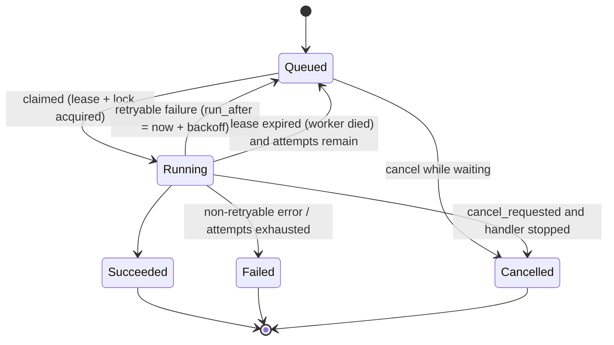
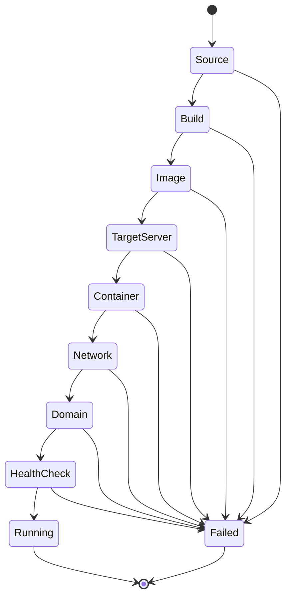
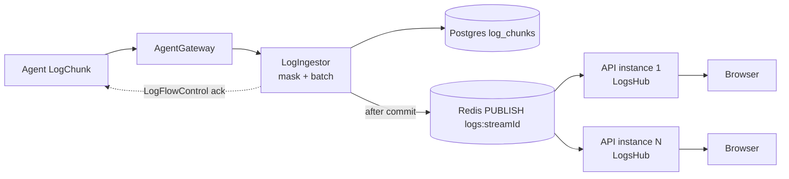

# ADR 0004: Jobs, deployments and logs

- Status: accepted
- Date: 2026-10-03
- Scope: durable job queue, per-application locking, retries and cancellation, deployment lifecycle and strategies, rollback, log persistence and live fan-out
- Spec: sections 5, 15, 16, 17, 19, 22, 54 of `docs/idea/01_AppIdea.md`
- Related: [ADR 0002](./0002-agent-communication.md) (agent protocol, idempotency, cancellation), [ADR 0003](./0003-api-conventions.md) (job resource, hubs)

## Context

Deploying is a multi-step, long-running, failure-prone operation that spans the control plane, build output, one or more servers and the proxy. It must survive control-plane restarts, never run two conflicting operations on one application, be cancellable, explain exactly where it failed, and stream logs live while also keeping them for later. The plan fixes the primitives: a durable Postgres `jobs` table claimed with `FOR UPDATE SKIP LOCKED`, a .NET `BackgroundService` worker host, advisory locks per application, and Redis for log pub/sub fan-out to SignalR.

## Decision summary

1. **Jobs** are rows in Postgres, claimed by workers with `FOR UPDATE SKIP LOCKED`, with leases, retries and cancellation. States: `Queued`, `Running`, `Succeeded`, `Failed`, `Cancelled`.
2. **Per-application serialization** with Postgres **session-level advisory locks** held on a dedicated connection for the life of the job.
3. A **deployment** is a separate, immutable-history entity driven by a job. Its lifecycle is the nine-step pipeline of spec section 5 with a recorded `failedStep` and reason.
4. Strategies are pluggable (`IDeploymentStrategy`): **Recreate** (MVP default) and **LowDowntime** (start new, health check, switch traffic, stop old).
5. Every successful deployment is a **rollback point**: an image reference plus an immutable configuration snapshot.
6. Logs are persisted as **chunked rows** and fanned out live through **Redis pub/sub to SignalR**; Postgres is the source of truth, Redis only accelerates.

## 1. Job queue

### Schema (logical; EF Core migration in WP0.2b)

```sql
CREATE TABLE jobs (
  id                 uuid PRIMARY KEY,                -- UUIDv7
  type               text        NOT NULL,            -- 'application.deploy', 'server.prune', ...
  status             text        NOT NULL,            -- queued|running|succeeded|failed|cancelled
  priority           int         NOT NULL DEFAULT 0,  -- higher first (spec 16: future use)
  resource_type      text,                            -- 'application' | 'service' | 'server' ...
  resource_id        uuid,
  lock_key           text,                            -- 'app:<uuid>' etc.; NULL = no serialization
  payload            jsonb       NOT NULL,            -- inputs (no secret values; ids/refs only)
  result             jsonb,
  error              jsonb,                           -- {code,title,detail,failedStep?,retryable}
  attempt            int         NOT NULL DEFAULT 0,  -- executions started
  max_attempts       int         NOT NULL DEFAULT 1,
  retry_no           int         NOT NULL DEFAULT 0,  -- bumps only after a REPORTED failure (idempotency keys)
  run_after          timestamptz NOT NULL DEFAULT now(),
  created_at         timestamptz NOT NULL DEFAULT now(),
  started_at         timestamptz,
  finished_at        timestamptz,
  locked_by          text,                            -- worker instance id
  lease_expires_at   timestamptz,
  cancel_requested_at timestamptz,
  parent_job_id      uuid,                            -- retry chain / sub-jobs
  idempotency_key    text,
  created_by         uuid,                            -- user (or the user behind a token); NULL for system jobs
  organization_id    uuid        NOT NULL             -- tenancy (added by WP1.5, FK organizations); every visibility filter uses it
);
CREATE INDEX jobs_claim_idx ON jobs (priority DESC, run_after, id) WHERE status = 'queued';
CREATE INDEX jobs_running_lock_idx ON jobs (lock_key) WHERE status = 'running';
CREATE INDEX jobs_resource_idx ON jobs (resource_type, resource_id, created_at DESC);
CREATE INDEX jobs_organization_idx ON jobs (organization_id, created_at);
```

`job_logs` / `log_chunks` are described in section 6.

### States



`Cancelling` is not a stored status: it is `status = running AND cancel_requested_at IS NOT NULL` and is exposed as `cancelRequested: true` on the API resource. `Retrying` is `queued` with `attempt > 0` and `run_after` in the future.

### Claiming

A worker host runs N slots (default 4, `AETHERA_JOB_CONCURRENCY`). Each slot loops: wait for a wake-up, claim, execute.

```sql
-- one claim attempt (inside a short transaction)
WITH next AS (
  SELECT j.id
  FROM jobs j
  WHERE j.status = 'queued'
    AND j.run_after <= now()
    AND (j.lock_key IS NULL OR NOT EXISTS (
          SELECT 1 FROM jobs r WHERE r.status = 'running' AND r.lock_key = j.lock_key))
  ORDER BY j.priority DESC, j.run_after, j.id
  FOR UPDATE SKIP LOCKED
  LIMIT 1
)
UPDATE jobs j
SET status = 'running',
    attempt = attempt + 1,
    started_at = COALESCE(started_at, now()),
    locked_by = @worker,
    lease_expires_at = now() + interval '60 seconds'
FROM next
WHERE j.id = next.id
RETURNING j.*;
```

- `SKIP LOCKED` lets many workers/instances claim concurrently without blocking or double-claiming.
- The `NOT EXISTS` pre-filter avoids picking jobs that would immediately fail the application lock; the advisory lock below is the real guarantee.
- **Wake-up**: enqueue does `NOTIFY aethera_jobs`; each worker host `LISTEN`s on a dedicated connection. A **5 s polling fallback** (and a timer for the earliest future `run_after`) covers missed notifications and restarts.
- **Fairness**: ordering is `(priority DESC, run_after, id)`; since `id` is UUIDv7 it is approximately FIFO within a priority. Priority is always 0 in the MVP.
- **Concurrency caps beyond the worker pool**: a per-server cap on concurrent *builds* (default 1 per server; `server.max_concurrent_builds`), enforced as another `NOT EXISTS ... count < cap` predicate for jobs of build types, so a small VPS is never overloaded by parallel builds.

### Leases and crash recovery

- While a job runs, its worker extends `lease_expires_at` every **10 s** (lease length 60 s) in a small update that also reads `cancel_requested_at`.
- A **reaper** (runs in every worker host every 15 s, uses `FOR UPDATE SKIP LOCKED` so one instance wins) finds `status = 'running' AND lease_expires_at < now()`:
  - attempts remain and the job type is resumable -> back to `queued` (`locked_by = NULL`, `run_after = now()`), `attempt` unchanged;
  - otherwise -> `failed` with `error.code = "job.worker_lost"`.
- The session-level advisory lock (below) is released automatically when the dead worker's connection drops, so the application is unlocked at the same moment the lease logic can requeue.
- Handlers are written to be **resumable**: deployment progress is checkpointed in `deployment_steps`, and agent commands are issued with idempotency keys `"<job_id>:<step>:<retry_no>"` (ADR 0002). A job picked up again after a crash re-enters the step that did not complete; the agent either returns the cached result or continues. `retry_no` stays the same on crash redelivery.

## 2. Per-application locking

Spec section 16: queued deployments, per-application locking, concurrent deployments where safe.

- Every job that mutates an application's runtime (`deploy`, `redeploy`, `rollback`, `restart`, `stop`, `start`, `delete`) carries `lock_key = 'app:<applicationId>'`; services use `service:<id>`; server-wide maintenance uses `server:<id>:maintenance`. Different keys run in parallel; same key runs strictly one at a time, in queue order.
- **Acquisition.** After claiming a job, the worker opens a **dedicated connection** (not from the EF pool) and runs `SELECT pg_try_advisory_lock(hashtextextended(@lock_key, 0))`.
  - Acquired: the connection stays open, holding the lock, for the whole job (at most `concurrency` such connections). Lock released with `pg_advisory_unlock` at the end, and implicitly if the process or connection dies.
  - Not acquired (race with another instance): the job is returned to `queued` with `run_after = now() + 2 s` **without** consuming an attempt.
- Why session-level advisory locks instead of only a status check: the `NOT EXISTS` filter is racy across concurrent claimers, while the advisory lock gives a hard, crash-safe mutual exclusion that disappears with the holder.
- **Queue semantics for deployments.**
  - Manual deploys always queue (never dropped), `queuePosition` is exposed.
  - Automatic (webhook) deploys set `supersedeQueued = true` by default: when a newer commit arrives while an older auto-deploy is still `queued`, the older queued job becomes `cancelled` with reason `superseded` (running ones are never auto-cancelled unless the app enables `cancelInProgressOnNewCommit`).
  - `restart`/`stop` issued while a deploy is running queue behind it; the UI shows "queued behind deployment #104".
- A deadlock is impossible by construction: one lock per job, acquired once, never nested.

## 3. Retries and backoff

- Each job type declares `max_attempts` and a retry classifier. Errors are classified when thrown:
  - **Retryable (transient)**: agent unavailable at dispatch, ack timeout, command `TIMED_OUT` due to connectivity, registry 5xx/network errors, Docker daemon temporarily unavailable, git network failure.
  - **Non-retryable (deterministic)**: validation, `POLICY_VIOLATION`, build failed (`BUILD_FAILED` from a non-zero exit), image/secret/config missing, health check failed after all probes, auth failures. Retrying cannot help and costs minutes.
- Backoff: `delay = min(5 min, 5 s * 2^(attempt-1))` with +/-20 % jitter; stored in `run_after`. Defaults: deploy jobs `max_attempts = 3` (only for failures *before the Build step starts or at infrastructure steps*, never a repeated build that failed on user code), prune/maintenance jobs 3, health-probe-only jobs 5.
- Retry at **step granularity** where possible: a transient failure at the Container step retries from the Container step, not from the build (the built image is already on the server; see checkpoints).
- Manual retry: `POST /jobs/{id}/retry` creates a **new job** (`parent_job_id` = original, `retry_no + 1` for idempotency keys) so history stays immutable.

## 4. Cancellation

User cancels a deployment/job via `POST /jobs/{id}/cancel` or `POST /deployments/{id}/cancel`.

1. **Queued** job: atomically `queued -> cancelled`. Done.
2. **Running** job: set `cancel_requested_at = now()` and `NOTIFY aethera_job_cancel`, return `202`. The owning worker learns within ~1 s (the notification, or the next lease heartbeat, whichever first) and signals the job's `CancellationToken`.
3. **Propagation to the agent** (ADR 0002): the handler keeps the set of in-flight `command_id`s per job. On cancel it sends `CancelCommand{command_id, reason: "job cancelled", grace: 15s}` for each. The agent cancels the build/pull/compose/probe; builds receive SIGINT then SIGKILL after grace; the agent answers `CommandResult(CANCELLED)`.
4. **Compensation.** The deployment step handler runs a `CleanupAsync` that depends on how far it got, then marks the deployment `cancelled`:
   - before Container: nothing on the server to undo besides build leftovers (pruned by cache policy);
   - at/after Container: remove the new, not-yet-live container (and its network attachments); **never touch the currently live container** (low-downtime) or, for Recreate, if the old container was already stopped, restart the previous deployment's container if `autoRollbackOnFailure` is on (default on);
   - volumes are never removed.
5. The job becomes `cancelled`. If the agent is unreachable the job is marked `cancelled` after `grace + 10 s` with `orphanedCommands: [...]`; when the agent returns, reconciliation cancels those commands (they would otherwise die at their deadline). Cancel on a finished job: `409 job.already_finished`.
6. Cancellation never loses logs: everything streamed so far is persisted and the stream ends with an `eof_reason` of `cancelled`.

## 5. Deployments

### Entities

- `deployments` (immutable history, spec 2.6): `id`, `application_id`, `environment_id`, `server_id`, `job_id`, `number` (per-application sequence, #104), `trigger` (`manual|webhook|redeploy|rollback|schedule|api`), `status`, `current_step`, `failed_step`, `failure_code`, `failure_reason`, `source` (type, repo URL, `ref`, `commit_sha`, commit message/author), `build_id`, `image_ref`, `image_digest`, `container_id`, `strategy`, `rollback_of_deployment_id`, `config_snapshot jsonb`, `created_at`, `started_at`, `finished_at`, `health_check jsonb` (last result).
- `deployment_steps`: `(deployment_id, step, status, started_at, finished_at, error_code, error_message, details jsonb)`, one row per step, written as the step starts and finishes (this is the checkpoint used for resume and the UI stepper).
- `builds`: build record (engine used, duration, image id/digest/size, commit, cache hit) linked from the deployment.

### Statuses

`queued` -> `inProgress` -> `running` (success: this is the live deployment) -> later `superseded` (replaced by a newer successful deployment, still a rollback point) or `stopped` (user stopped the app). Terminal failure states: `failed`, `cancelled`. An application's *current* deployment is the single one with status `running`.

### Lifecycle state machine



(`Cancelled` can branch from every step; omitted for readability.)

Each step has a defined purpose, agent commands, persisted output, and failure codes. **Failure at any step records `failed_step` (one of the nine) and a machine `failure_code` + human `failure_reason`** on the deployment and the step row, the same data surfaced as `error` on the job and rendered on the deployment page (spec section 40).

| # | Step | What happens | Agent commands (ADR 0002) | Output recorded | Typical failure codes |
|---|---|---|---|---|---|
| 1 | **Source** | Resolve what to build: branch -> commit SHA (via git provider API or `git ls-remote`), validate credentials, load commit metadata; for image sources resolve tag | `BuildDetect` (optional); none for plain image | `source.commit_sha`, message, author | `source.ref_not_found`, `source.auth_failed`, `source.unreachable` |
| 2 | **Build** | Clone + build with the chosen `IBuildEngine`. `IMAGE` engine: skipped (status `skipped`). Compose: skipped or `ComposePull`/build per project | `BuildRequest` (streams BUILD logs) | `build_id`, engine, duration, cache hit | `build.failed`, `build.timeout`, `build.engine_unavailable`, `server.out_of_disk` |
| 3 | **Image** | Tag `aethera/<app-slug>:<deploymentId>` (and registry name); if the target differs from the build server or a registry is configured: push and pull. Record digest | push inside `BuildRequest`; `ImagePull` on the target | `image_ref`, `image_digest`, size | `image.pull_failed`, `registry.auth_failed`, `image.push_failed` |
| 4 | **Target server** | Verify the target server is selected, agent connected (or SSH fallback capable), Docker running, enough disk/memory vs resource requests, ports free | `ContainerList`, `DiscoveryRefresh` if stale | selected server, transport | `server.agent_unavailable`, `docker.unavailable`, `server.insufficient_resources`, `port.conflict` |
| 5 | **Container** | Create (and start, per strategy) the container from the snapshot: env (secrets injected here, in memory), labels, ports, volumes, resources, restart policy, healthcheck. Volumes are created if missing, never removed | `VolumeCreate`, `ContainerCreate`, `ContainerStop/Remove` (old, per strategy) | `container_id` | `container.create_failed`, `container.start_failed`, `container.oom` |
| 6 | **Network** | Ensure the project's internal network exists and attach the container with aliases; attach to the proxy network per strategy | `NetworkCreate(if_not_exists)`, `NetworkConnect` | networks | `network.failed` |
| 7 | **Domain** | Ensure the proxy is installed/configured and routing labels/config are in place; verify DNS (warn-only) and certificate readiness | `ProxyEnsure`, `HealthProbe` (route) | routes, DNS result, cert state | `proxy.failed`, `domain.dns_mismatch` (warning), `domain.cert_failed` (warning) |
| 8 | **Health check** | Probe per the application's health config (HTTP/TCP/container; interval, timeout, retries, start period). Must pass before the new version is promoted | `HealthProbe` | last probe result, attempts | `health.failed`, `health.timeout`, `container.exited` |
| 9 | **Running** | Promote: mark this deployment `running`, previous one `superseded`, clean up old containers (strategy), prune old images per retention, emit notifications | `ContainerRemove`, `ImagePrune(keep=[rollback points])` | `finished_at` | (cleanup failures are warnings, not deployment failures) |

Source-type variations: *Docker image*: Build skipped. *Static*: Build produces a small static-server image (engine output). *Compose*: Container + Network steps are a single `ComposeUp` (project-scoped, user compose file untouched plus the Aethera override file); health is per-service. *Services* (databases): same pipeline minus Source/Build.

Steps log to the `DEPLOY` stream (control-plane narration: "Step 5/9 Container: creating ae-api-0190f3c4") while builds log to the `BUILD` stream; both are visible on the deployment page.

### Configuration snapshot

At the moment the job starts (not when it was queued), the engine freezes `config_snapshot`: build config, runtime config (ports, command), env var **names and plain values**, **references with pinned versions** for secrets (secret id + version, never values), volumes, domains, resources, health check, strategy. Consequences:

- Redeploy and rollback use the snapshot, not today's mutable config, so they reproduce the old behaviour (`restoreConfig: true`, default). Secrets are versioned and old versions are retained while a deployment referencing them is a rollback point.
- Secrets are resolved to values only inside the Container step, sent as `SecretValue`, never written to the snapshot, logs or job payload.

### Naming and labels

- Image: `aethera/<app-slug>:<deploymentId>` (plus the registry host when pushing). Container: `ae-<app-slug>-<deploymentIdShort>`.
- Labels on every managed object: `aethera.managed=true`, `aethera.project.id`, `aethera.environment`, `aethera.application.id`, `aethera.deployment.id`, `aethera.server.id`, `aethera.role=app|service|proxy`. Discovery and prune use them to scope what Aethera may touch; unlabelled objects are never pruned without explicit user action.

### Strategies (`IDeploymentStrategy`)

The strategy decides the order of steps 5-9. It is validated against the configuration up front (`strategy.unsupported` if impossible, e.g. LowDowntime with a fixed published host port).

**Recreate** (MVP default, spec section 54): predictable, simplest, brief downtime.

1. Step 5: `ContainerStop(old)` then `ContainerRemove(old)` -> `ContainerCreate(new, start=true)`.
2. Network, Domain as above; Health check on the new container.
3. On failure and `autoRollbackOnFailure` (default true): remove the failed container and recreate the previous deployment's container from its snapshot (same image still on the host), mark the new deployment `failed` and the previous one still `running`; the failure is reported honestly (the deployment is failed even though the app is serving the old version).

**LowDowntime** ("start new, verify, switch, stop old", spec 5.1). It uses the proxy network as the traffic switch, so it works with plain `NetworkConnect/Disconnect` commands and does not depend on every image having a Docker `HEALTHCHECK`:

1. Create and start the new container on the app's **internal project network only** (not on the proxy network). Traefik is configured with `providers.docker.network=aethera-proxy` (and each app carries `traefik.docker.network=aethera-proxy`), so it only routes to containers it can reach on the proxy network; the new container receives **no traffic** yet even though its routing labels are already present.
2. Health check the new container directly: `HealthProbe` against its internal address from the agent.
3. If healthy: **switch** = `NetworkConnect(proxyNetwork, new)`. Traefik picks the new container up (both versions now serve for a moment, which is acceptable for stateless HTTP).
4. `NetworkDisconnect(proxyNetwork, old)`, wait the drain period (default 10 s, `drainSeconds`), then `ContainerStop(old)` (with the container's stop timeout) and `ContainerRemove(old)`.
5. If the health check fails: remove the new container; the old version never stopped serving -> **zero impact**, deployment `failed` at `HealthCheck`.

Constraints (validated at config time): HTTP(S) routed apps only; no fixed host-port publishing; data stores with exclusive volume access must use Recreate. Where unsupported the engine falls back to Recreate with a visible note when `strategyFallback = true`, otherwise it refuses. Rolling, Blue/Green and Canary (spec 54) slot in later behind the same interface.

### Redeploy, restart, stop/start

- **Redeploy**: new deployment (trigger `redeploy`), reuses the previous deployment's `image_ref` and snapshot (or the current config if the user chooses), skips Source/Build/Image(push). Useful after config changes (spec 5.3).
- **Restart**: `ContainerRestart` job only; no deployment record, a lifecycle event row (`restarted`) on the application timeline.
- **Stop/Start**: `ContainerStop` / `ContainerStart` of the current deployment's containers (Compose: `down`/`up` without removing volumes); application status `stopped`.

### Rollback points and rollback

- Every deployment that reaches `Running` is a **rollback point**: it holds `image_ref` + `image_digest` + `config_snapshot`. `GET /applications/{id}/deployments?rollbackPoints=true` lists them.
- **Retention**: keep the images of the last **5** rollback points per application on each server (configurable); `ImagePrune` always passes those references in `keep`. Older deployment *records* stay forever (until the log/deployment retention policy removes them); only their images are cleaned, after which that deployment is no longer a *selectable* rollback point (`rollbackAvailable: false`) unless the image is in a registry.
- **Rollback** (`POST /applications/{id}/rollback {deploymentId}`) creates a **new** deployment (`trigger = rollback`, `rollback_of_deployment_id`), runs Source/Build as `skipped`, makes sure the image exists on the target server (present locally, else `ImagePull` by digest from the registry, else fails at **Image** with `rollback.image_unavailable`), then executes the configured strategy with the old snapshot. History stays linear and auditable; "Deployment #102" restored shows as #105 "rollback of #102".
- Database migrations are not rolled back (documented limitation); the UI warns when the deployment being restored is older than a schema-affecting one marked by the user.

## 6. Logs

### Streams and sources

A `stream_id` identifies one log stream: `build:<buildId>`, `deploy:<deploymentId>`, `container:<containerId>:<n>` (live, ad hoc), `agent:<serverId>`, `job:<jobId>` (control-plane narration for non-deployment jobs). Sources map to `LogSource` in the protocol (BUILD, DEPLOY, CONTAINER, AGENT). Spec section 17 requires build, deployment, application, agent and system logs.

### Persistence: chunked rows

```sql
CREATE TABLE log_chunks (
  stream_id   text        NOT NULL,
  sequence    bigint      NOT NULL,              -- from the agent / control plane, per stream
  ts          timestamptz NOT NULL,              -- time of first line in the chunk
  source      smallint    NOT NULL,
  stream      smallint    NOT NULL,              -- 1 stdout, 2 stderr
  data        text        NOT NULL,              -- UTF-8 (invalid bytes replaced), 1..64 KiB
  PRIMARY KEY (stream_id, sequence)
);
```

- One row per **chunk**, not per line: a 50k-line build is ~100 rows instead of 50k. The log API splits chunks into lines for the client; line numbers are derived (chunk sequence + offset), search runs over chunk text server-side (`ILIKE`, with a `pg_trgm` GIN index on `data` optional later) and returns matching chunks with line offsets.
- The ingestor (`LogIngestor`) receives `LogChunk`s from the gateway (and control-plane narration), coalesces small neighbours (same stream/source, <= 64 KiB, <= 250 ms), masks known secret values (defence in depth after the agent's masking), and writes with **batched multi-row `INSERT ... ON CONFLICT (stream_id, sequence) DO NOTHING`** (batches of up to 100 chunks or 100 ms). `DO NOTHING` makes agent replay after reconnect idempotent (ADR 0002).
- Only **after the batch commits** does it grant flow-control credit to the agent (`LogFlowControl.acked_sequence`) and publish to Redis, so anything a client has seen is recoverable from Postgres.
- Per-stream size cap (default 50 MiB, `AETHERA_LOG_MAX_BYTES_PER_STREAM`); beyond it the ingestor writes one `... log truncated ...` marker and drops further data (agent is told via window 0).
- **Retention**: build/deploy/job logs are kept for 30 days *and* for the most recent 100 deployments per application, whichever keeps more (configurable); a daily maintenance job deletes expired streams (if volume demands it, `log_chunks` is range-partitioned by month on `ts` so retention is `DROP PARTITION`). Live container logs (`container:*`) are **not** persisted: Docker is their store; the UI streams `docker logs --tail/--since` on demand. Agent logs (WARN+) keep 7 days.
- **Download**: `GET /deployments/{id}/logs?format=text` streams the concatenated chunks as `text/plain` with a `Content-Disposition` filename; no buffering of the whole log in memory (`FETCH` in pages of chunks).

### Live fan-out: Redis pub/sub -> SignalR



- Channel per stream: `logs:{streamId}`; payload `{streamId, sequence, ts, stream, source, text}` (JSON, chunk granularity). Job/deployment state uses `jobs:events`, server state `servers:events`.
- Each API instance's `LogsHub` keeps, per stream with local subscribers, one Redis subscription (reference-counted; unsubscribe when the last client leaves). SignalR groups are `logs:{streamId}`. This works with one instance (the MVP) and with several, with no SignalR backplane required for logs; job/server events use the same mechanism.
- **Late joiner / resume** (`Subscribe(streamId, fromSequence)`): (1) join the group and start buffering live messages; (2) read stored chunks `WHERE stream_id = @s AND sequence >= @from ORDER BY sequence` and send them; (3) flush the buffer skipping `sequence <= lastSent`; (4) continue live. A sequence **gap** on the live path (Redis is fire-and-forget) triggers a targeted re-read from Postgres. Redis loss therefore degrades to slightly higher latency, never to missing lines.
- **Rate shaping**: the hub batches into `LogLines` frames (<= 64 KiB, flushed every 100 ms). A client that cannot keep up (SignalR send buffer full) is told `LogStreamEnded(reason: "slow_consumer")` and resyncs from REST rather than slowing the pipeline; the ingestor never waits on browsers.
- **Authorization**: subscribing to `logs:{streamId}` requires the caller's permission on the stream's owner resource (deployment/application/server); streams for deployments of applications the user cannot read are refused.
- **Container live logs**: `Subscribe` on a `container:*` stream sends `LogStreamStart` to the agent (follow, tail N) when the first subscriber arrives and `LogStreamStop` when the last leaves (after a 30 s grace to survive page reloads). These chunks skip Postgres: ingestor -> Redis -> hub only, credit is granted per fan-out.

### Search, filter, inspect

- Server-side: `GET /deployments/{id}/logs?q=error&stream=stderr&from=<ts>&limit=...` (cursor `afterSequence`); the UI also filters the in-memory live buffer client-side. Timestamps are shown from `ts` (+ line offset); download as text.
- Build logs additionally expose `GET /builds/{id}` (duration, commit, cache hit) per spec section 4.3.

## 7. Failure and edge handling

| Situation | Behaviour |
|---|---|
| Control plane restarts mid-deploy | Job lease expires, reaper requeues, handler resumes at the first incomplete `deployment_steps` row; agent commands are re-dispatched with the same idempotency key and answer from cache |
| Agent disconnects mid-build | Build continues on the host; logs spool; on reconnect the gateway reconciles, resumes log acks, and receives the (cached) result. If the agent never returns, the step fails with `server.agent_unavailable` at the command deadline + 30 s |
| Health check never passes | Deployment `failed` at `HealthCheck` with the last probe output and the last 200 container log lines attached to the step; old version retained (LowDowntime) or restored (Recreate + autoRollback) |
| Disk full on target | Command returns `ERROR_CODE_OUT_OF_DISK`; failure code `server.out_of_disk`; the UI links the server's maintenance prune action |
| Two webhooks for the same commit | Idempotency key = provider delivery id; same commit already queued -> second is a no-op returning the existing job |
| Worker crash while holding the app lock | Connection drops, advisory lock released, lease expiry requeues; no manual unlock needed |
| User deletes an application with a queued/running job | Delete is a job under the same lock key; it queues behind the running one, or the user cancels first |

## Alternatives considered

| Option | Why not |
|---|---|
| Hangfire / Quartz / MassTransit | Another dependency and storage model; our needs (claim, lease, lock-by-key, cancellation propagation to agents, domain-specific state) are small and well served by ~500 lines on Postgres, which we already require |
| Redis as the job queue | Not durable by default; loses jobs and state on restart without extra care; Postgres gives transactions with deployment rows |
| Row lock (`FOR UPDATE`) on the application row for serialization | Holds a DB transaction open for the whole deploy (minutes); advisory locks on a dedicated connection are cheaper and self-releasing |
| Transaction-level advisory locks | Released at commit; would not cover the long-running job body |
| Log rows per line | Write amplification (tens of thousands of rows per build), bloat; chunks keep ingestion and storage cheap and still allow line-level reads |
| Stream logs only via Redis / only via DB polling | Redis alone is lossy and non-resumable; polling alone is high-latency. Persist-then-publish gives durability and liveness |
| Blue/green via Traefik label swapping on a running container | Docker labels are immutable after creation; the proxy-network attach/detach switch achieves the same with the allowlisted commands |

## Consequences

- (+) Deployments survive restarts and network flaps; every failure names its step; logs are complete, searchable and live.
- (+) The same machinery drives deploys, maintenance, DNS/TLS jobs and later backups and schedules (spec sections 15, 34, 35).
- (-) A hand-written job runner is code we own (claiming, leases, reaper); mitigated by integration tests against the real Postgres (kill-worker, double-claim, lock contention, cancel races) written with the job system (WP1.3).
- (-) Holding one connection per running job adds pool pressure; bounded by worker concurrency (default 4) and sized into the Npgsql pool settings.
- (-) LowDowntime only covers routed HTTP apps with a proxy network; other workloads use Recreate (documented).
